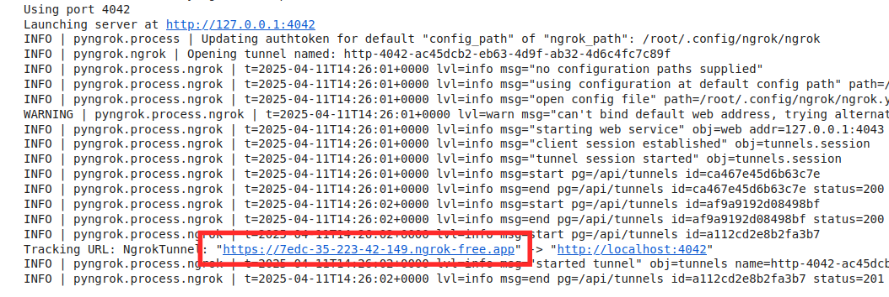

## General Principles

The data analysis kit is continuously integrated set of tools which provide versatile and deployable

1. Data explorer and subsetting We foresee to develop 3 distinct end-user facing apps.
2. Diverse visualization and analysis dashboards, which can be also run interactively as standard `jupyter` notebooks.
3. Other example analysis pipelines which integrate additional tools and datasets, such as those in [MGnify](https://www.ebi.ac.uk/metagenomics)


[](https://mybinder.org/v2/gh/emo-bon/momics-demos/HEAD)
[](https://colab.research.google.com/github/palec87/momics-demos/)

The interactive `jupyter` content is available in *marine-omics-demos (momics-demos)* [repository](https://github.com/emo-bon/momics-demos). Methods supporting these dashboards are compiled in an additional *marine-omics-methods (momics)* [repository](https://github.com/emo-bon/marine-omics-methods). Separation of the methods and demos aims to provide testable methods and as much flexibility and remixing of the functionalities provided as possible. See the details of the momics [documentation](https://marine-omics-methods.readthedocs.io/en/latest/index.html).

Dashboards are implemented in [panel](https://panel.holoviz.org/) by Holoviz. The momics-demos repository can be deplyoed to any jupyter server. To promote ease of first contact, NBs are designed to run locally after cloning the repository, run on `mybinder.org` or in `google colab` environment.

Notebooks can be run as is, and panel widgets combined with your own code, or alternatively design your own workflow ignoring the widgets and using only the `momics-methods`. To serve the dashboard from the NB, click the panel icon


## Run locally or on JupyterHub server

```bash
# setup venv (conda example)
conda create -n momics-demos python

# clone repository
git clone https://github.com/emo-bon/momics-demos

# install dependencies (using poetry here)
pip install -e .[dependencies]

# setup jupyterlab kernel
python -m ipykernel install --user --name momics-demos

# run local server (not applicable for server deployment)
python -m jupyterlab
```

## Run on binder

Follow one of the links to the NBs in the README file or . Note that out of experience, `Google Colab` runs faster, however you need a `ngrok` account (see [](#important-note)).

## Run on Google colab

Follow one of the links to the NBs in the README file or open the whole repository by pasting `https://github.com/emo-bon/momics-demos` into a `GitHub` field on [colab.research](https://colab.research.google.com/).

### IMPORTANT NOTE

At the moment, NBs/dashboards loaded over Google Colab run **FASTER** than the `binder` equivalents. However, in order to display a dashboard or even separate dashboard components (widgets), you will need `ngrok` [account](https://ngrok.com/), which basically:

- after registering, you will need to put your token in the `.env` file, which you upload to the root of you GColab session
  - `NGROK_TOKEN="..........."`
  - alternatively you manually define it directly in a new cell `os.environ["NGROK_TOKEN"] = "my_secret_token"`
- In practice, ngrok creates a tunnel to a separate url with the dashboard
- will show you a link as below, which contains the dashboard



## Design principles

1. Minimize dependencies (*already failing*) to facilitate wide adaptation and further development of the codebase.
2. Simplicity over speed, however performance is considered.
3. (*Not implemented yet*) Data import/export options after UDAL queries made easy. (backend data queries developed by VLIZ)
4. Combining strengths of python/R/julia packages developed in those languages.
5. API calls to other services, such as [Galaxy](https://earth-system.usegalaxy.eu/).
