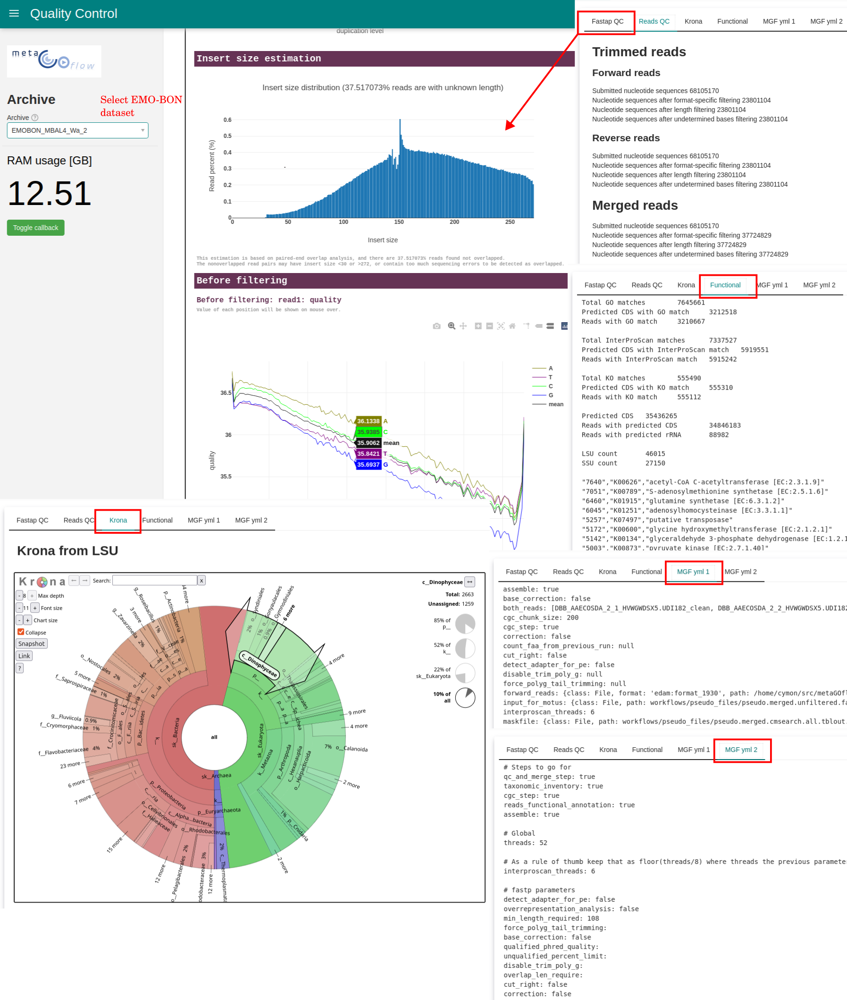

# MetaGOflow

:::{note} Last update 👈
:class: dropdown
David Palecek, May 26, 2025
:::
MetaGOflow is a slim version of MGnify pipeline [1](https://doi.org/10.1093/gigascience/giad078). Both taxonomy and functioinal annotation is done from reads, however contigs are assembled using MEGAHIT too.

There are almost 60 output files from the metaGOflow pipeline. This [dashboard](https://github.com/emo-bon/momics-demos/blob/main/wf1_metagoflow/quality_control.ipynb) provides interface to the most relevant and not too big metaGOflow pipeline outputs, including:

1. `fastp` Qaulity Control report with interactive QC plots.
2. Reads Quality control, both `trimmed` and `merged` reads.
3. Interactive Krona plots from SSU and LSU taxonomy tables, respectively.
4. Functional annotation summaries expressed in number of reads matched to respective databases.

